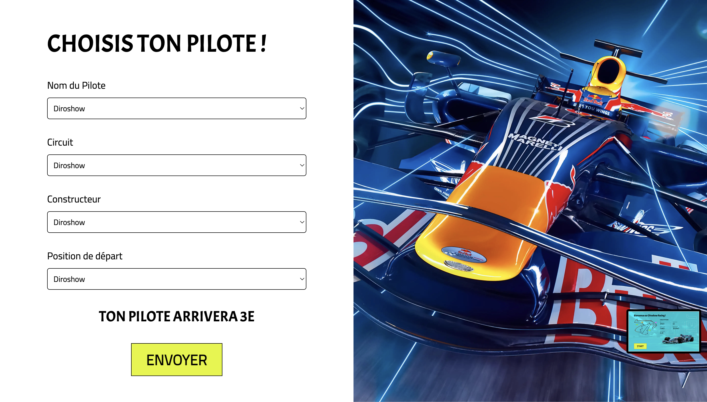

# Project Racing Python

Lancement de Jupyter (dans le dossier jupyter)

```bash
python -m notebook    
```

Lancement du serveur avec Django :

```bash
python manage.py runserver
```

# Screenshots




L’objectif de notre application est de donner la position d’un pilote de racing en fonction des informations que l’utilisateur a saisie à l’aide d’une intelligence artificielle.

Pour cela, nous avons utilisé l’API Formula 1 World Championship
. En effet, cette dernière nous donne toutes les informations nécessaires avec les pilotes, les courses, les temps et bien d’autres pour entrainer l'IA et développer notre application.

```bash
https://www.kaggle.com/datasets/rohanrao/formula-1-world-championship-1950-2020   
```

La partie front-end est réalisé avec le framework Django. Voici l'architecture du projet avec les explications :

api : l'
jupyter : dossier du notebook
racing: dossier principal de l'application avec tous les paramètres. La vue principal se trouve dans le dossier template : home.html
static: l'ensemble des assets du projet comme les images ou les fichier css


