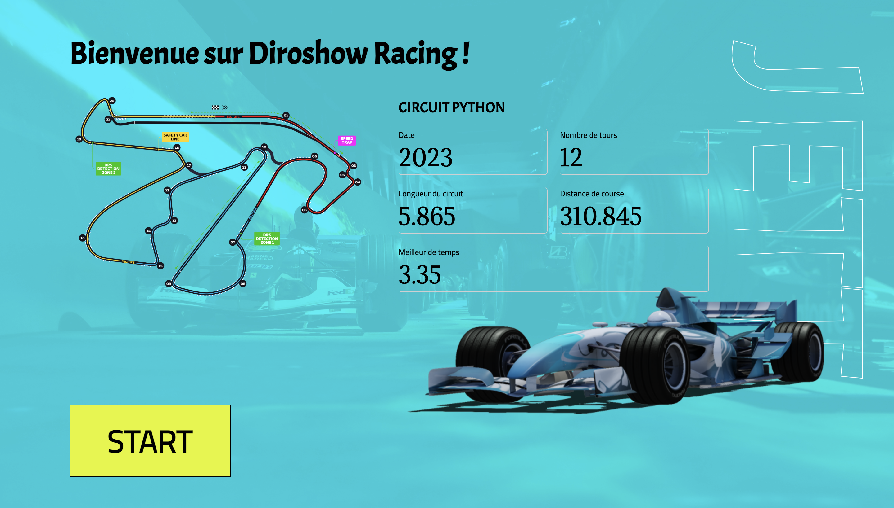
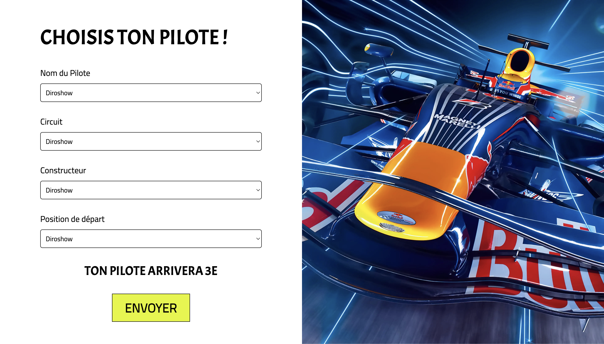

# Project Racing Python

Lancement de Jupyter (dans le dossier jupyter)

```bash
python -m notebook    
```

Lancement du serveur avec Django :

```bash
python manage.py runserver
```

Lancement du serveur avec FastApi :

```bash
cd api && uvicorn main:app --reload --port 7999 
```

# Screenshots




L’objectif de notre application est de donner la position d’un pilote de racing en fonction des informations que l’utilisateur a saisie à l’aide d’une intelligence artificielle.

Pour cela, nous avons utilisé l’API Formula 1 World Championship
. En effet, cette dernière nous donne toutes les informations nécessaires avec les pilotes, les courses, les temps et bien d’autres pour entrainer l'IA et développer notre application.

```bash
https://www.kaggle.com/datasets/rohanrao/formula-1-world-championship-1950-2020   
```

La partie front-end est réalisé avec le framework Django. Voici l'architecture du projet avec les explications :

* api : l'ensemble des fichiers pour l'api, le modele est généré avec l'api. Le fichier main.py dans ce dossier permet de déployer une API REST en utilisant FastAPI pour prédire le résultat d'une course de Formule 1 en fonction de la position de départ, de la moyenne de la position de départ du pilote pour la même course, de la moyenne de la position de départ du constructeur pour la même course et des identifiants du pilote et du constructeur. Le modèle utilisé est un XGBoost entraîné sur un jeu de données de résultats de courses de Formule 1.
* jupyter : dossier du notebook qui permet de faire des tests sur les données et de voir les résultats de l'IA.
* racing: dossier principal de l'application avec tous les paramètres. La vue principal se trouve dans le dossier template : home.html
* static: l'ensemble des assets du projet comme les images ou les fichier css